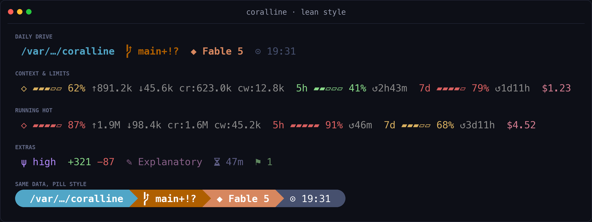
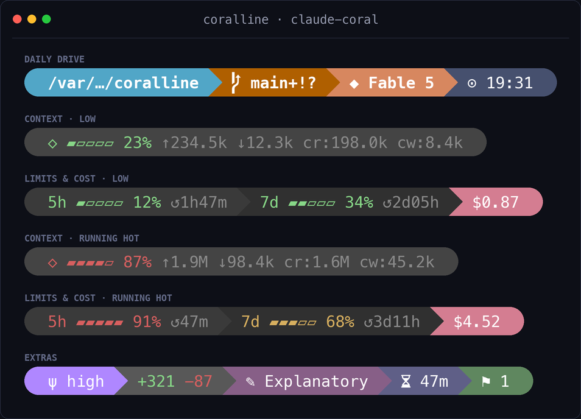
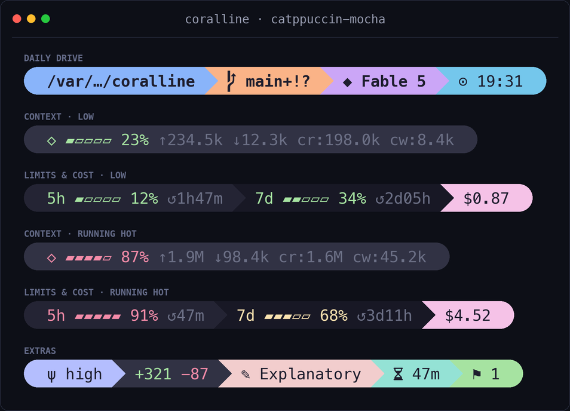
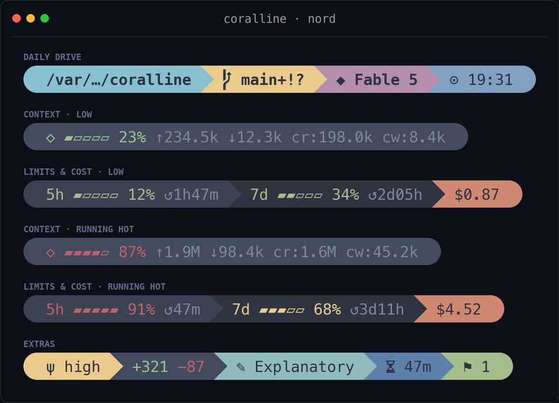
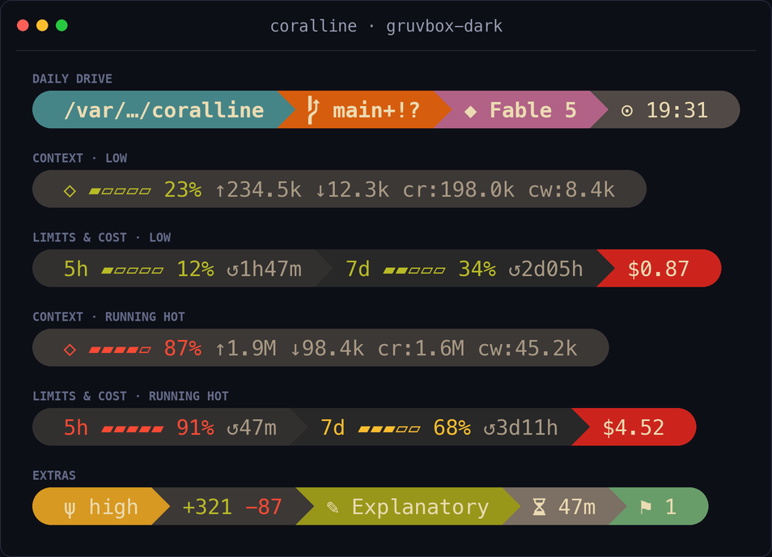
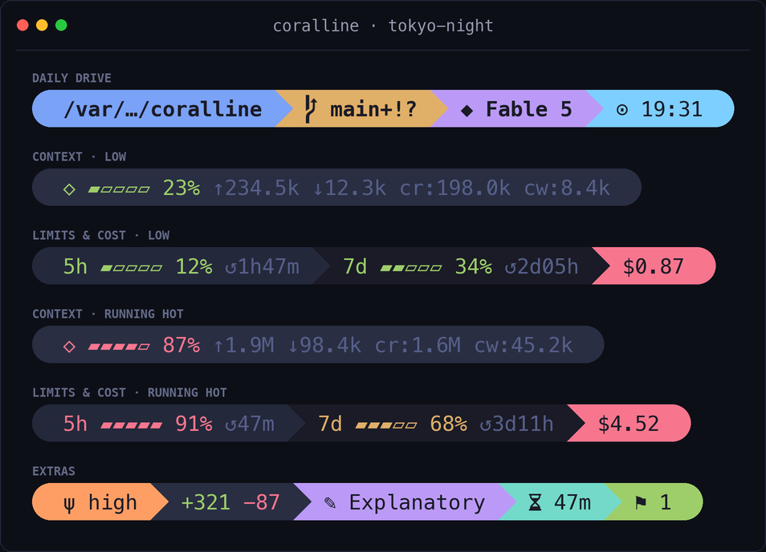
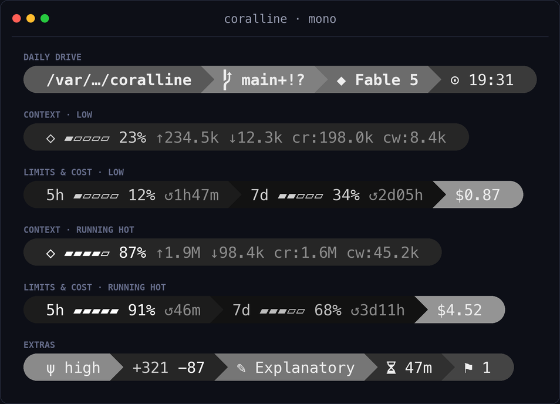
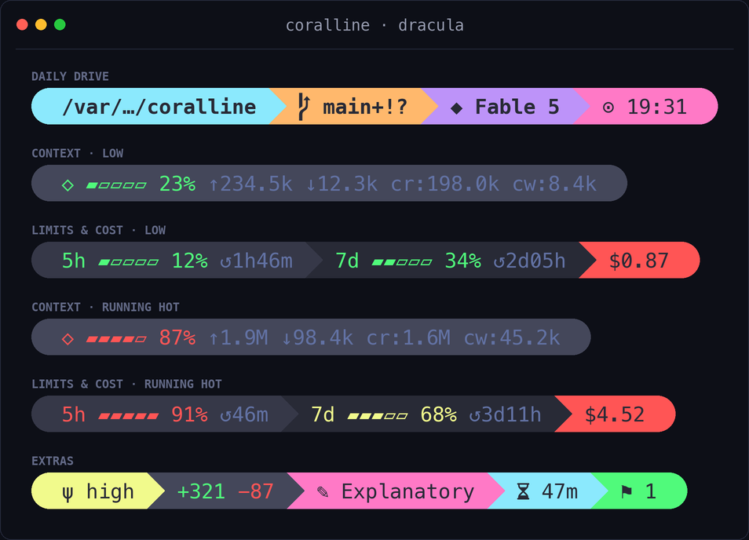
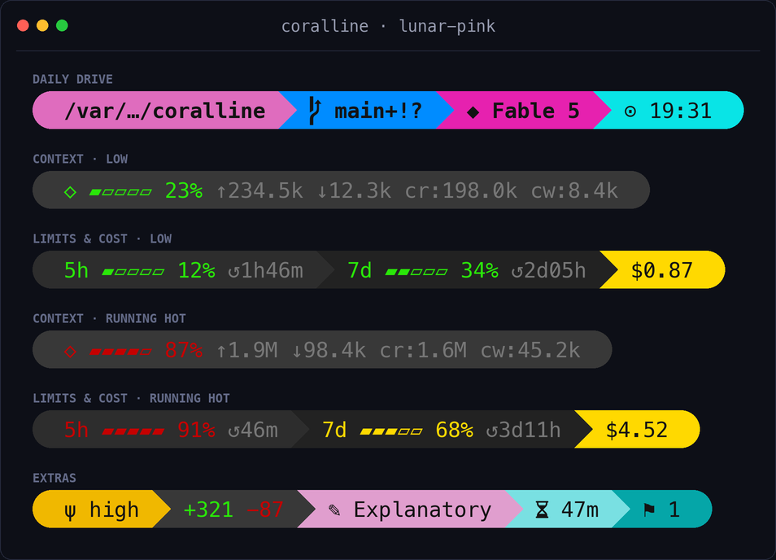

# coralline

> A [Powerlevel10k](https://github.com/romkatv/powerlevel10k)-inspired statusline for Claude
> Code. This fork rewrites the rendering hot path from bash to a native Go executable,
> eliminating the MSYS zombie-process problem on Windows
> ([background](./openspec/changes/go-renderer-core/proposal.md)). The bash renderer is
> retained for features not yet ported.

[繁體中文說明](./README.zh-TW.md)


## What you get

```text
╭ ~/side-project/coralline  ⬢ coralline  ⎇ main+!  ◆ Fable 5  ψ high  ⬡ ▰▰▰▱▱ 62% ↑1.2M ↓45.6k  5h ▰▰▱▱▱ 41% ↺2h44m  7d ▰▰▰▰▱ 79% ↺1d11h  +321 −87  $1.23  ✎ Explanatory  ⧖ 47m  ⚑ 1  ⊙ 02:45 pm ╮
```

| Segment | Shows | Go |
|---|---|---|
| `dir` | current directory, long paths collapsed to `~/a/…/z` | ✅ |
| `project` | repo name (`⬢`), stable across every worktree; hidden outside a git repo | — |
| `git` | branch, staged `+` / modified `!` / untracked `?`, ahead `⇡` behind `⇣` | ✅ |
| `node` | active Node version (Nerd Font `nf-dev-nodejs_small`) from `.nvmrc` / `.node-version` (or `node` on `PATH` with `VL_RUNTIME_PROBE=1`); hidden when undetected; opt-in | — |
| `python` | active Python env (Nerd Font `nf-dev-python`) — `$VIRTUAL_ENV` / conda (skips `base`) / `.python-version` (or `python3` on `PATH` with `VL_RUNTIME_PROBE=1`); hidden when undetected; opt-in | — |
| `model` | active Claude model | ✅ |
| `effort` | reasoning effort level (`ψ`) — `low` / `med` / `high` / `xhigh` / `max` | ✅ |
| `ctx` | context-window gauge, input/output/cache token counts | ✅ |
| `limit5h` / `limit7d` | rate-limit gauges with reset countdown | ✅ |
| `burn` | range-to-empty: projected time until the binding limit (5h or 7d) hits 100% at the recent burn rate (`↗`); opt-in by adding `burn` to `VL_SEGMENTS` | ✅ |
| `lines` | lines added/removed this session | — |
| `cost` | session cost in USD | — |
| `style` | active output style | — |
| `duration` | session wall-clock duration | — |
| `stash` | git stash count | — |
| `clock` | time, 12h or 24h | — |

**Go** column: ✅ = supported by the Go renderer, **—** = bash renderer only.

The Go renderer supports the **pill** style and **fixed multi-line** layout.
The **lean**, **classic** styles and **auto** (responsive) layout are currently
bash-only. Both renderers share the same `coralline.conf` and `themes/*.conf`
files — switching between them requires no config changes.

Gauges change color as they fill: green → yellow at 50% → red at 75% (thresholds configurable).

## Install

See [INSTALL.md](./INSTALL.md) for the full installation guide. The primary
path is building the Go renderer:

```bash
cd cmd/coralline && go build -o coralline.exe .
```

Then register the compiled binary as the `statusLine` command in
`~/.claude/settings.json`. If you need segments or styles not yet ported to Go,
the bash renderer is documented in the
[INSTALL.md Appendix](./INSTALL.md#appendix-bash-renderer-installsh).

## Update

Once installed, updating is one command from the repo root — `./update.ps1`
(Windows) or `./update.sh` (macOS/Linux). It pulls, runs the full test suite,
and only then builds and deploys the binary (plus any changed themes) to
`~/.claude/coralline/`. If tests or the build fail, the installed statusline
is left untouched.

## Trust and security

The Ask-Claude install is a remote document that instructs an AI to run `curl | bash` and
touch `~/.claude/settings.json`. That shape is exactly what a prompt-injection attack looks
like, so a Claude that red-flags it before proceeding is behaving correctly. The answer to
that skepticism is inspection, not trust:

- **Read what runs.** Everything is in this repo: [install.sh](./install.sh) (about 270
  lines) copies files and merges one `statusLine` key into `settings.json`, and
  [INSTALL.md](./INSTALL.md) is the playbook the AI follows. Have your Claude read both
  before approving anything; that is the intended flow.
- **Pin a release.** `... | bash -s -- --ref v0.9.1` installs a tagged release instead of
  `main`, so what you audited is what you run. The interactive installer already offers the
  latest tag by default.
- **What gets written, exactly:** files under `~/.claude/coralline/`, your choices in
  `~/.claude/coralline.conf`, and one `statusLine` entry merged into
  `~/.claude/settings.json` (a timestamped `settings.json.bak.*` backup is created first).
  Nothing else.
- **What runs afterwards:** the Go renderer is a single binary that makes zero network
  requests; the only external command it spawns is one `git` call per render. The bash
  renderer is pure bash with one `jq` and one `git` call per render. Your prompts, keys,
  and usage data never leave the machine.
- **Why INSTALL.md addresses the AI:** humans get the visual wizard, AIs get an interview
  script, so the playbook speaks to the reader that executes it. A document that opens by
  addressing your AI deserves scrutiny, which is why every artifact it references lives in
  this repo where both of you can read it first.

### Uninstall

```bash
rm -rf ~/.claude/coralline ~/.claude/coralline.conf
```

Then delete the `statusLine` block from `~/.claude/settings.json` (or restore the newest
`settings.json.bak.*`). Nothing else is left behind.

## Configuration

Everything lives in `~/.claude/coralline.conf` (plain bash, sourced by the script):

| Variable | Default | Meaning |
|---|---|---|
| `VL_STYLE` | `pill` | `pill`: powerline pills · `lean`: flat colored text (bash only) · `classic`: lean on a uniform dark bar (bash only) |
| `VL_LAYOUT` | `fixed` | `fixed`: one line per `VL_SEGMENTS*` var · `auto`: responsive (bash only) |
| `VL_MAX_LINES` | `3` | `auto` only — wrap into at most this many lines (`1` = never wrap) |
| `VL_WRAP_MARGIN` | `4` | `auto` only — columns kept free on the right so segments never touch the edge |
| `VL_SEGMENTS` | `dir git model ctx limit5h limit7d cost clock` | segments on line 1, in order (the full list in `auto` mode) |
| `VL_SEGMENTS2` / `VL_SEGMENTS3` | _(empty)_ | `fixed` only — optional second/third line |
| `VL_CLOCK` | `12h` | `12h` / `24h` / `off` |
| `VL_CLOCK_SECONDS` | `1` | show seconds in the clock |
| `VL_BAR_WIDTH` | `5` | gauge width in cells |
| `VL_PATH_DEPTH` | `4` | collapse paths deeper than this |
| `VL_NAME_MAX` | `0` | max chars for the `project` / `git` names before `…` truncation (`0` = off) |
| `VL_COST_DECIMALS` | `2` | decimal places for the cost segment |
| `VL_WARN_PCT` / `VL_HOT_PCT` | `50` / `75` | gauge color thresholds |
| `VL_ASCII` | `0` | `1` disables Nerd Font glyphs |
| `VL_RUNTIME_PROBE` | `0` | `node` / `python`: `1` = also detect via `node` / `python3` on `PATH` when no pin file (forks per render) |
| `VL_BG_*` / `VL_FG_*` | theme | colors — `256`-color index or `"R,G,B"` |

### Burn-rate segment


Off by default. Add `burn` to `VL_SEGMENTS` to show a "range to empty" — the projected
time until whichever rate limit (5h or 7d) binds first, e.g. `↗ 5h ⇢ 1h58m`. Keys:
`CORALLINE_BURN_WINDOW` (recent-slope lookback, default 600s), `VL_BURN_GLYPH` (default
`↗`), `VL_BG_BURN` (defaults to the 5h background). While `burn` is in the segment list,
coralline writes samples to `~/.claude/coralline/burn-5h.tsv`; drop it from the list and
nothing is written.

The ETA is coloured by urgency against the window reset, and collapses to a glyph when a
number would be noise:

| You see | When |
|---|---|
| `↗ 5h ⇢ 1h58m` **red** | you'd empty *before* the window resets |
| `↗ 5h ⇢ 1h58m` **yellow** | reset and empty are a close call |
| `↗ 5h ⇢ 1h58m` **green** | the window resets with room to spare |
| **bright** `↗ ✓` | at this pace a full window can't run dry — a number like `24d15h` would just be noise |
| **dim** `↗ ✓` | idle: you've stopped burning, nothing in flight |
| **dim** `↗ …` | warming up: a cold start with no samples yet (deliberately *not* a green check, so a fresh install doesn't read as healthy) |

The label tells you which limit binds — whichever of `5h`/`7d` will hit 100% soonest.
`5h` only appears once you're burning hard enough to register at least two integer-%
steps within the recent window; at a light or steady pace there's no short-term slope to
fit, so the 7d projection binds and you see `↗ 7d`.

### Cross-session limit sync (optional)

`VL_LIMIT_SYNC=1` makes `limit5h` / `limit7d` show the freshest rate-limit reading any of your sessions has seen, instead of just this session's own snapshot. Each render records its `5h` / `7d` value to a small per-host store (`limit-5h.d` / `limit-7d.d`), and the segments display the highest percentage recorded for the current window. Off by default.

This exists because Claude Code re-renders a session's statusline only when that session is active, and the rate-limit numbers it passes are that session's last-seen values. So idle sessions show stale, divergent percentages. With sync on, every session converges to the latest known value the next time it redraws.

> **It only updates on redraw.** It cannot refresh a session that is not redrawing at all, and "latest known" is only as fresh as your most recently active session. coralline has no API access. So this narrows the gap between sessions, it does not make a fully idle bar live.

Single-session users gain nothing from it (there is only one snapshot), so it stays opt-in.

### Responsive layout (bash only)

With `VL_LAYOUT="auto"` the bar stays on a single line while it fits, and greedily wraps into
up to `VL_MAX_LINES` rows when the window gets narrow. Once the line cap is reached, remaining
segments overflow on the last line. `VL_WRAP_MARGIN` keeps a few columns free on the right so
wrapped lines never butt against the window edge — raise it if your terminal adds padding.

Width comes from `$COLUMNS`. Claude Code v2.1.153+ sets `COLUMNS` to the current terminal width
before running the status line, so wrapping responds to window resizing out of the box. Outside
Claude Code the script falls back to `stty size` on the controlling terminal; if neither is
available it stays on one line.

```text
wide window:    ~/dev/app  ⎇ main  ◆ Fable 5  ⬡ ▰▰▰▱▱ 62%  5h ▰▰▱▱▱ 41%  $1.23  ⊙ 14:45

narrow window:  ~/dev/app  ⎇ main  ◆ Fable 5
                ⬡ ▰▰▰▱▱ 62%  5h ▰▰▱▱▱ 41%  $1.23  ⊙ 14:45
```

Prefer a layout that never moves? Keep `VL_LAYOUT="fixed"` and pin rows with
`VL_SEGMENTS` / `VL_SEGMENTS2` / `VL_SEGMENTS3`.

### Lean style (bash only)

Prefer Powerlevel10k's *lean* look — no backgrounds, just colored text? Set
`VL_STYLE="lean"` and each segment's `VL_BG_*` color becomes its text accent instead:



| Variable | Default | Meaning |
|---|---|---|
| `VL_STYLE` | `pill` | set to `lean` for the flat look |
| `VL_LEAN_SEP` | _(empty)_ | extra text between segments, e.g. `·` |
| `VL_LEAN_FG` | _(empty)_ | force a text color; empty = inherit each segment's accent |
| `VL_LEAN_BG` | _(empty)_ | paint one uniform background behind the row — `"R,G,B"` or 256 index. For the full p10k *classic* look, prefer the `VL_STYLE="classic"` preset below — it wires this up for you |
| `VL_LEAN_CAP_R` | _(empty)_ | trailing cap glyph drawn in the `VL_LEAN_BG` color to bevel the bar's end into the terminal (p10k's end separator, e.g. `$''`); needs `VL_LEAN_BG` |
| `VL_LEAN_CAP_L` | _(empty)_ | leading cap glyph — the left-facing mirror of `VL_LEAN_CAP_R` at the bar's start (e.g. `$''`); needs `VL_LEAN_BG`. Stock p10k *classic* leaves it flat |

> **Tip:** already a p10k user? Tell the AI installer or the visual wizard to import your
> `~/.p10k.zsh` — it will carry over your style, colors, and time format after you opt in.
> See the [AI interview notes in INSTALL.md](./INSTALL.md#ai-interview).

### Classic style (bash only)

Want Powerlevel10k's stock *classic* prompt — one uniform dark bar with colored
text and a solid end cap? Set `VL_STYLE="classic"`. It's a one-word preset: it
renders like `lean` on a dark bar (p10k's `POWERLEVEL9K_BACKGROUND`) with a
trailing powerline cap, no other knobs required.


| Variable | Default | Meaning |
|---|---|---|
| `VL_STYLE` | `pill` | set to `classic` for the p10k dark-bar look |
| `VL_BG_BAR` | _(empty → `238`)_ | the uniform bar color behind the row — `"R,G,B"` or 256 index. Any theme's palette rides this bar; grayscale palettes (e.g. `mono`) want an explicit `VL_BG_BAR` for contrast |

Under the hood `classic` is `lean` plus a `VL_LEAN_BG` (from `VL_BG_BAR`) and a
`VL_LEAN_CAP_R` end cap, so an explicit `VL_LEAN_BG` or cap still wins. Importing
a p10k *classic* config carries over your exact bar color and separator.

## Float readout (optional, bash only)

`VL_FLOAT=1` makes `statusline.sh` write a one-line **plain-text** readout to
`~/.claude/coralline/float.txt` on every render (segments from
`VL_FLOAT_SEGMENTS`, default `model ctx cost`). That's all coralline does —
it ships **no display carrier**. The file is the seam: pipe it wherever you want
a glanceable readout that stays visible without looking at Claude Code's bottom
statusline (a terminal status bar, tmux, a menu-bar app, …).

The readout is **plain text** (no ANSI color), so the default favors stable,
glance-friendly segments and leaves the color-driven limit warnings
(`limit5h` / `limit7d`) in the bottom statusline, where threshold colors work.
You can still add them to `VL_FLOAT_SEGMENTS` if you want the numbers up top.

**Config keys**

| Key | Default | Meaning |
|---|---|---|
| `VL_FLOAT` | `0` | `1` = write `float.txt` each render |
| `VL_FLOAT_SEGMENTS` | `model ctx cost` | segments rendered into the readout (plain text, no color) |
| `VL_FLOAT_SEP` | `  ·  ` | separator between segments |
| `VL_FLOAT_FILE` | `~/.claude/coralline/float.txt` | where the readout is written |

(Or toggle `VL_FLOAT` via "float readout" in `configure.sh`'s Details menu.)

A worked iTerm2 carrier (the `coralline-float` companion + setup steps) lives in
[`example/float-display-iterm2/`](example/float-display-iterm2/) — copy it into
your dotfiles and adapt. Other terminals (tmux, WezTerm, a menu-bar app, …) just
need to read `float.txt` the same way.

## Themes

| | |
|---|---|
| **`claude-coral`** — steel blue · mauve · Claude coral (default)<br> | **`catppuccin-mocha`** — soft pastels on dark<br> |
| **`nord`** — arctic frost<br> | **`gruvbox-dark`** — warm retro<br> |
| **`tokyo-night`** — neon on deep navy<br> | **`mono`** — grayscale minimalism<br> |
| **`dracula`** — cyan · pink · purple on charcoal<br> | **`lunar-pink`** — pink · cyan · yellow on near-black<br> |
| **`reverie`** — soft pastels · plum text on warm-dark<br> | |

A theme is just a `.conf` file assigning `VL_BG_*` / `VL_FG_*` — copy one, change the colors,
and source yours from `coralline.conf` instead. PRs with new themes are welcome.
The wizard discovers themes automatically from `themes/*.conf` and nested collections such as
`themes/best-themes/*.conf`, so adding a theme file does not require editing `configure.sh`.

> **Adding a theme?** Copy an existing `.conf`, set every `VL_BG_*` / `VL_FG_*`
> (including `VL_BG_EFFORT`; `VL_BG_BAR` is optional — only grayscale palettes need
> it, to keep the classic bar readable), add its name to the `THEMES` list in
> [`tools/render-screenshots.py`](./tools/render-screenshots.py), re-run it to generate
> `assets/theme-<name>.png`, and add a row to the table above. Please **don't regenerate
> `hero.png`** — it's a fixed sampler of the original six themes, not a full catalog.

## Platform support

| Platform | Status |
|---|---|
| macOS | ✅ supported — Go renderer or bash renderer |
| Linux | ✅ supported — Go renderer or bash renderer |
| Windows | ✅ supported — Go renderer is the recommended path (native .exe, no MSYS dependency) |
| Windows + Git Bash | ✅ bash renderer also works when Git Bash and `jq` are installed |

> **Windows note:** the Go renderer runs natively without Git Bash or `jq`. If you use the
> bash renderer, install [Git for Windows](https://git-scm.com/download/win) (which bundles
> Git Bash) and `jq`.

## Why it's fast

The Go renderer is a single native binary: it makes no network or API calls, spawns only
one `git` child process per render, and has a 5-second hard watchdog. No `jq`, no bash,
no MSYS layer on Windows.

The bash renderer is also fast: one `jq` invocation extracts every field at once, one
`git status --porcelain=v2 --branch` call provides branch, dirty state, and ahead/behind
together. No `bc`, no per-field subprocess spam. Works on stock macOS bash 3.2 and any
Linux bash.

Both renderers run every second (`refreshInterval: 1`) and make zero network requests.
Claude Code pipes the session JSON to them on stdin and renders whatever they print.

## Acknowledgements

The visual language of coralline — segmented pills, powerline transitions, the `⇡⇣` git
glyphs, gauges that shift color as they fill — is a loving tribute to
[Powerlevel10k](https://github.com/romkatv/powerlevel10k) by
[@romkatv](https://github.com/romkatv), which set the bar for what a fast, beautiful prompt
can be. Thanks also to the wider [powerline](https://github.com/powerline/powerline) lineage
that started it all, and to [Nerd Fonts](https://www.nerdfonts.com/) for the glyphs that make
the pill shapes possible.

As for the name: coralline algae build reefs one thin, colorful layer at a time —
and **coral·line** is exactly what this is: a line, in Claude's coral.

## License

[MIT](./LICENSE)
